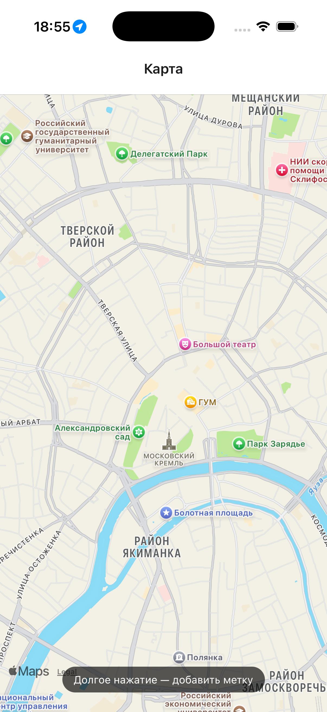
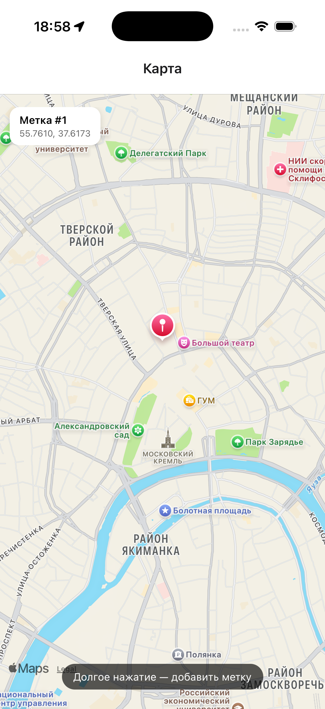
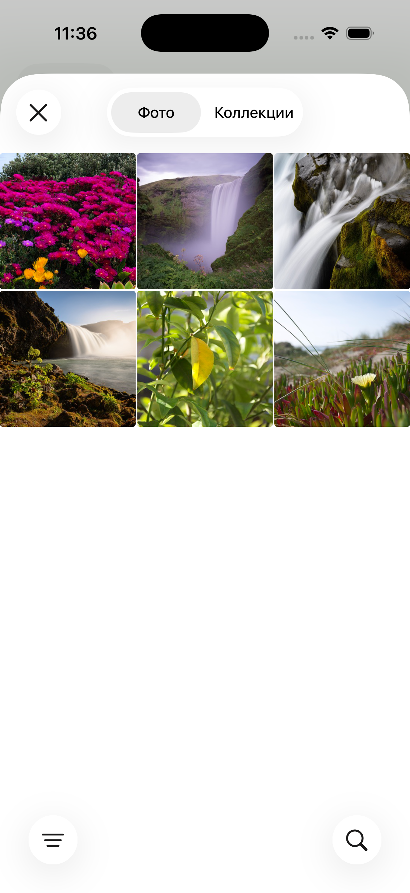
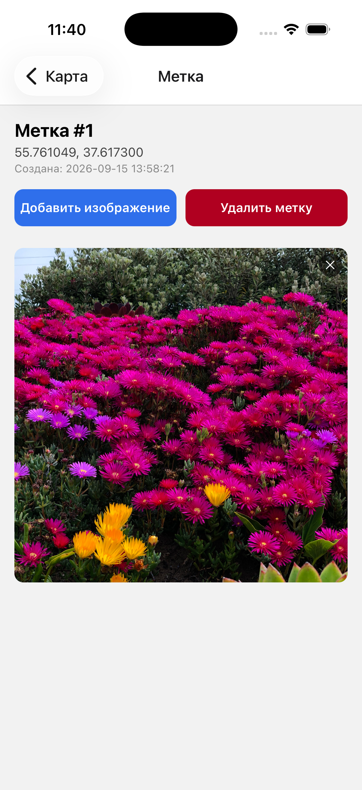
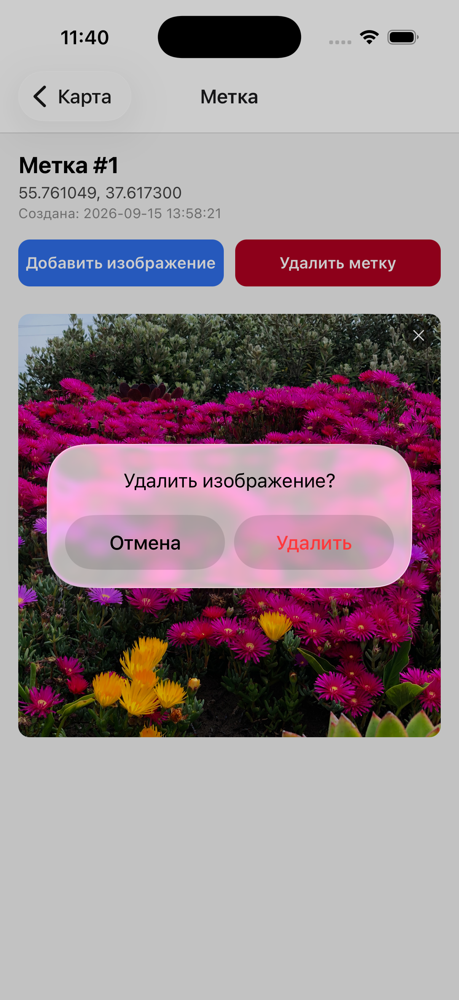
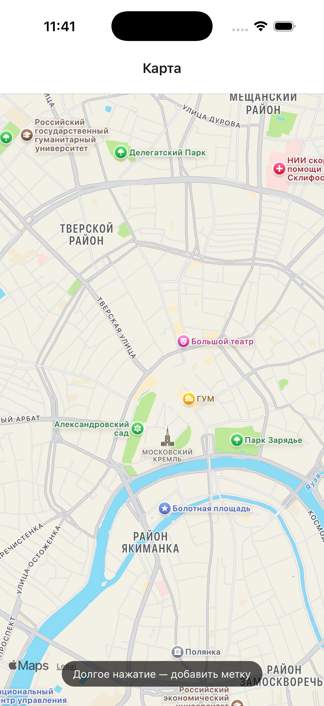

# Map App

Учебное приложение на React Native (Expo + TypeScript), объединяющее задания 1–3:
карта с метками, локальная база данных на SQLite и геолокация с уведомлениями
о приближении к сохранённым точкам.

Автор: Мальков Иван

## Стек

- Expo SDK 57.0.24, TypeScript
- Expo Router (файловая маршрутизация)
- react-native-maps
- expo-sqlite (`SQLiteProvider` / `useSQLiteContext`)
- Drizzle ORM (`drizzle-orm/expo-sqlite`)
- expo-image-picker
- expo-location
- expo-notifications

## Установка и запуск

```bash
cd map-app
npm install
npx expo start
```

Отсканируйте QR-код в приложении **Expo Go** на телефоне, либо запустите
эмулятор: `npm run android` / `npm run ios` / `npm run web`.

### Запуск на Android-эмуляторе (macOS / Linux)

В Android Studio установите Android SDK Platform-Tools и Android Emulator,
а в Device Manager создайте виртуальное устройство (AVD). Затем выполните:

```bash
npm run android
```

Скрипт `scripts/android.sh` находит SDK в стандартном каталоге, проверяет
инструменты и запускает приложение через Expo Go. Expo CLI использует подключённое
Android-устройство или запускает доступный эмулятор. Чтобы выбрать конкретный AVD,
запустите его заранее в Device Manager; отключите физический телефон, если приложение
должно открыться именно в эмуляторе.

Для SDK в другом каталоге задайте `ANDROID_HOME`. Дополнительные параметры Expo
передаются после `--`, например `npm run android -- --clear` для очистки кэша.
Остановка сервера: `Ctrl+C`.

На Android используется Leaflet с тайлами OpenStreetMap, поэтому Google Maps
API-ключ и биллинг не нужны. Для загрузки карты эмулятору нужен доступ к
`unpkg.com` и `*.tile.openstreetmap.org`. На iOS применяется нативная карта.

## Юнит-тесты

```bash
npm test              # разовый прогон
npm run test:watch    # в режиме наблюдения
npm run test:coverage # с отчётом о покрытии
```

Используются `jest` + `jest-expo` (пресет для Expo/React Native) и
`@testing-library/react-native`. Тестами покрыты фичи карты, меток,
геолокации, уведомлений и общих компонентов из `features/`, а также оба экрана (`app/index.tsx`,
`app/marker/[id].tsx`, `app/_layout.tsx`). Внешние зависимости
(`expo-sqlite`, `expo-location`, `expo-notifications`, `expo-image-picker`,
`expo-router`, `react-native-maps`) в тестах замоканы.

Тестовые файлы намеренно вынесены в отдельный `__tests__/` для экранов
из `app/` (а не рядом с самими экранами) — `expo-router` строит маршруты
из всех файлов внутри `app/`, и тестовый файл там мог бы быть по ошибке
воспринят как ещё один экран.

## Структура проекта

```
app/
  _layout.tsx        — корневой layout, подключает DatabaseProvider и LocationProvider
  index.tsx           — экран карты
  marker/[id].tsx      — экран деталей метки
features/
  map/components/      — общий менеджер карты, Apple Maps и Android OpenStreetMap
  markers/
    components/        — список меток и сетка изображений
    data/              — таблицы Drizzle, репозиторий CRUD и DatabaseProvider
  location/            — GPS-трекинг, расчёт расстояния и LocationProvider
  notifications/       — разрешения и менеджер локальных уведомлений
  shared/              — обработка ошибок и общие UI-компоненты
types.ts                — общие TypeScript-интерфейсы
```

## Функциональность

### Карта (Задание 1)
- Полноэкранная карта, долгое нажатие от 600 мс добавляет метку в указанной точке.
- Метки кликабельны и ведут на экран деталей (`/marker/[id]`).
- Горизонтальная лента меток поверх карты для быстрого перехода.
- На iOS используется нативный `react-native-maps`; на Android — Leaflet в
  `WebView` с OpenStreetMap. Экран работает без Google Maps API-ключа и биллинга.

### Детали метки (Задание 1)
- Координаты и дата создания метки.
- Сетка изображений, привязанных к метке; добавление через `expo-image-picker`,
  удаление отдельных изображений долгим/коротким нажатием на крестик.
- Удаление самой метки (с подтверждением) каскадно удаляет её изображения.

## Скриншоты тестирования (iOS Simulator)

Полный сценарий: создание метки, выбор и добавление изображения, удаление
изображения, затем удаление самой метки.

<p>
  
  
  
</p>
<p>
  
  
  
</p>
<p>
  
  
  
</p>

### База данных (Задание 2)

Схема (см. `features/markers/data/schema.ts` и `tables.ts`):

```sql
CREATE TABLE markers (
    id INTEGER PRIMARY KEY AUTOINCREMENT,
    latitude REAL NOT NULL,
    longitude REAL NOT NULL,
    created_at DATETIME DEFAULT CURRENT_TIMESTAMP
);

CREATE TABLE marker_images (
    id INTEGER PRIMARY KEY AUTOINCREMENT,
    marker_id INTEGER NOT NULL,
    uri TEXT NOT NULL,
    created_at DATETIME DEFAULT CURRENT_TIMESTAMP,
    FOREIGN KEY (marker_id) REFERENCES markers (id) ON DELETE CASCADE
);
```

- `PRAGMA foreign_keys = ON` включается при инициализации, поэтому
  `ON DELETE CASCADE` реально работает, а вставка изображения с
  несуществующим `marker_id` завершается ошибкой ограничения.
- Инициализация и миграции — по `PRAGMA user_version` в `features/markers/data/schema.ts`,
  выполняются один раз через `onInit` в `SQLiteProvider`.
- Удаление маркера выполняется в транзакции Drizzle:
  сначала изображения, затем сам маркер.
- Весь доступ к БД идёт через `features/markers/data/DatabaseContext.tsx`:
  компоненты используют хук `useDatabase()`, а репозиторий формирует
  типизированные запросы через Drizzle.
- Ошибки операций перехватываются, логируются в dev-режиме и сохраняются в
  `error` контекста, не роняя приложение.

### Геолокация и уведомления (Задание 3)
- `LocationProvider` запрашивает разрешение на геолокацию и подписывается на
  `watchPositionAsync` (обновление раз в 5 секунд / при смещении на 5 метров).
- При каждом обновлении координат расстояние до всех меток считается по
  формуле Хаверсина (`features/location/location.ts`).
- Порог приближения — 100 метров (`PROXIMITY_THRESHOLD_METERS` в
  `LocationContext.tsx`).
- `NotificationManager` хранит активные уведомления в `Map<markerId, ...>`,
  чтобы не показывать дубликаты, пока пользователь остаётся в зоне метки, и
  отменяет уведомление при выходе из зоны.
- Разрешение на уведомления запрашивается отдельно и не блокирует работу
  карты/геолокации, если пользователь отказал.

## Обработка ошибок

- Выбор изображения: ошибки `ImagePicker` и отказ в доступе к галерее
  показываются через `Alert`, не прерывая работу экрана.
- Навигация: переходы обёрнуты в try/catch с алертом при сбое.
- Карта: нативная iOS-карта считает отсутствие `onMapReady` в течение 10 секунд
  ошибкой загрузки. Android-карта ожидает событие готовности от Leaflet.
- База данных: ошибки инициализации показывают отдельный экран-заглушку;
  ошибки операций (CRUD) перехватываются в `DatabaseContext`, логируются в
  dev-режиме (успех и неудача каждой операции) и не приводят к краху
  приложения. Нарушение ограничения внешнего ключа (`FOREIGN KEY constraint
  failed`, например при добавлении изображения к несуществующей метке)
  перехватывается в `features/markers/data/repository.ts` и переводится в понятную
  ошибку домена.
- Геолокация/уведомления: отказ в разрешении отображается баннером на экране
  карты, не блокируя остальной функционал.
- `expo-notifications` в Expo Go на Android (начиная с SDK 53) не поддерживает
  push-функциональность, и сам факт загрузки модуля падает с исключением при
  первом обращении. `features/notifications/notifications.ts` загружает пакет лениво через
  отложенный `require()` внутри try/catch, а `features/shared/services/errorReporting.ts`
  явно помечает эту конкретную известную ошибку как некритичную (не
  показывает баннер «Что-то пошло не так» пользователю) — уведомления в этом
  случае просто не показываются, остальной функционал не затрагивается.
  Проверка Android + Expo Go теперь выполняется **до импорта** пакета:
  ленивый импорт и подавление баннера сами по себе не предотвращают исключение
  при инициализации push API. На iOS и в собственной сборке API загружается как обычно.

## Инструкции по тестированию (Задание 3)

### Геолокация через симулятор Expo Go

1. На iOS-симуляторе: меню **Features → Location** позволяет задать
   фиксированные координаты или проиграть заранее заданный маршрут
   (например, «City Run» проходит рядом с несколькими случайными точками —
   удобно для проверки входа/выхода из зоны метки).
2. На Android-эмуляторе: расширенные настройки эмулятора (**⋮ → Location**)
   позволяют вручную задать широту/долготу или загрузить GPX/KML-маршрут.
3. На реальном устройстве с включённым режимом разработчика можно
   подменить местоположение через системные Developer Options
   (Android: Mock Location App) — приложению для этого не нужны
   дополнительные права, `expo-location` считывает то, что отдаёт ОС.

### Проверка сценариев уведомлений

1. Поставьте метку на карте долгим нажатием рядом с текущим (или
   симулируемым) местоположением.
2. Задайте координаты в пределах 100 м от метки (`PROXIMITY_THRESHOLD_METERS`
   в `features/location/LocationContext.tsx`) — должно появиться уведомление
   «Вы рядом с меткой!».
3. Не меняя координат, подождите следующего обновления (`timeInterval` —
   5 с) — повторного уведомления быть не должно (дедупликация через
   `Map<markerId, ActiveNotification>` в `features/notifications/notifications.ts`).
4. Отодвиньте симулируемую точку за пределы порога — уведомление должно
   быть отменено (`cancelScheduledNotificationAsync`).
5. Для проверки нескольких меток одновременно поставьте 2–3 метки рядом
   друг с другом и переместите точку так, чтобы попасть в зону сразу
   нескольких — каждая обрабатывается независимо в цикле `checkProximity`.
6. Сворачивание приложения в фон **не** останавливает уже запущенную
   подписку `watchPositionAsync` в рамках текущей сессии ОС, но обновления
   не гарантированы после длительного пребывания в фоне — см.
   «Известные ограничения» ниже (полноценный background-режим не
   реализован).

## Дополнительные возможности

Сверх базовых требований трёх заданий реализовано:

- Горизонтальная лента меток (`features/markers/components/MarkerList.tsx`) поверх карты
  для быстрого перехода к деталям без клика по маркеру на карте.
- Глобальная обработка ошибок рендера: `features/shared/components/GlobalErrorBoundary.tsx`
  перехватывает необработанные ошибки React-дерева и показывает экран
  восстановления вместо краха приложения; `features/shared/components/ErrorBanner.tsx` —
  переиспользуемый баннер для некритичных ошибок (сеть, геолокация).
- Отдельный сервис `features/shared/services/errorReporting.ts` для централизованного
  логирования ошибок в dev-режиме.
- Версионирование схемы БД через `PRAGMA user_version` с местом для
  будущих миграций (`features/markers/data/schema.ts`), вместо однократного
  `CREATE TABLE IF NOT EXISTS` без версии.
- Явные транзакции Drizzle для удаления маркера вместе
  с изображениями и перевод нарушений внешнего ключа (`FOREIGN KEY
  constraint failed`) в понятные ошибки домена — см. `features/markers/data/repository.ts`.
- Эвристическая детекция ошибки загрузки карты по таймауту `onMapReady`,
  так как `react-native-maps` не предоставляет отдельного события ошибки.

## Известные ограничения

- Тестировалось через Expo Go 57.0.9 с проектом на SDK 57.0.24; кастомные
  нативные модули не подключались.
- Уведомления о приближении работают, пока приложение активно (foreground);
  фоновая геолокация (`expo-task-manager` / background location) не
  реализована, так как не входит в объём задания.
- Порог приближения и интервалы обновления геолокации — фиксированные
  константы, без настройки через UI.
- Android-карте требуется интернет-доступ к CDN Leaflet (`unpkg.com`) и
  серверам тайлов OpenStreetMap (`*.tile.openstreetmap.org`). При его
  отсутствии базовый слой карты не загрузится.
